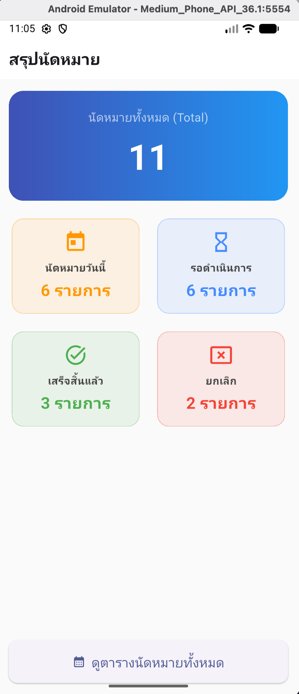
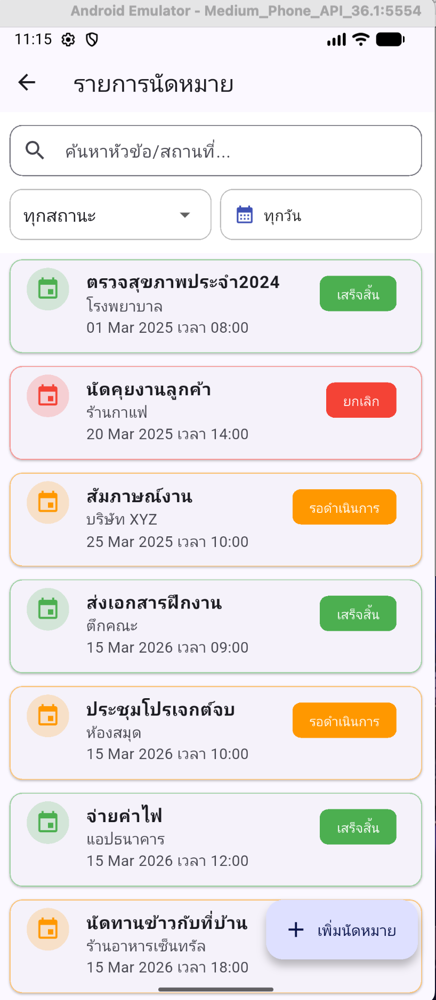
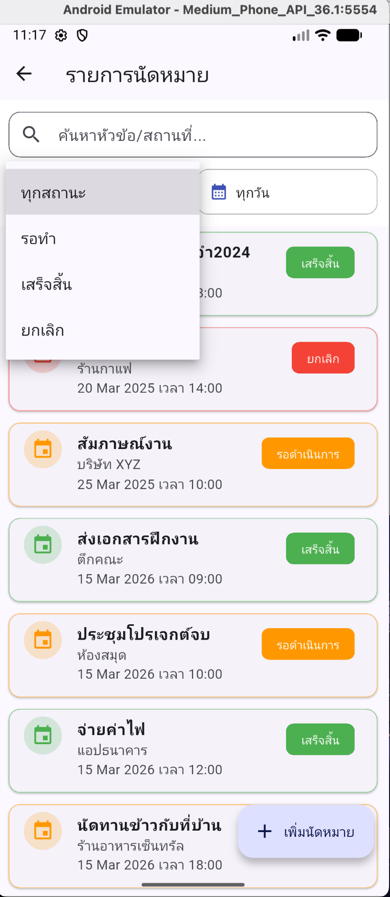
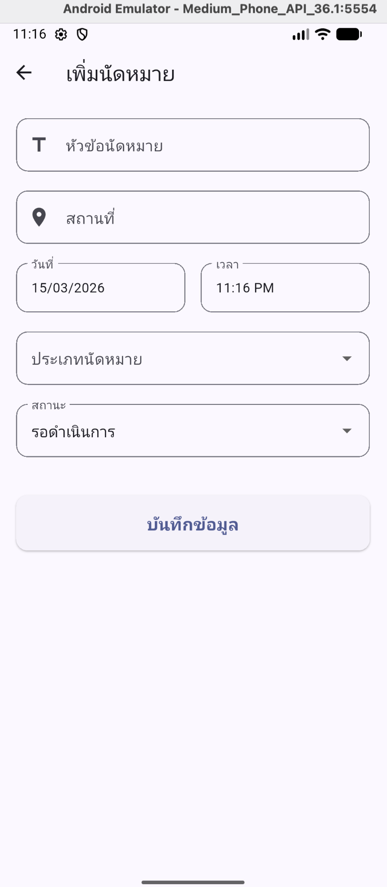
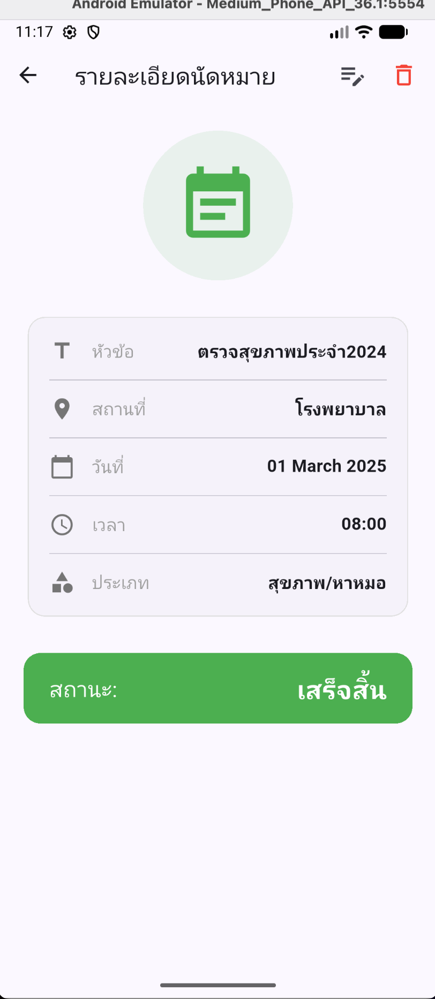

# แอปจัดการนัดหมายส่วนตัว (Appointment Manager App) 🗓️
โมบายแอปพลิเคชันสำหรับบันทึกและจัดการตารางนัดหมาย พัฒนาด้วย Flutter โดยเน้นการจัดการสถานะข้อมูลอย่างมีประสิทธิภาพและเก็บข้อมูลภายในตัวเครื่อง

**วิชา:** ENGSE608 Mobile Devices Application Design and Development  
**โจทย์ที่ได้รับ:** โจทย์ที่ 9 - แอปจัดการนัดหมาย  
**ผู้จัดทำ:** นายพนาวุฒน์ อภิปสันติ 
**รหัสนักศึกษา:** 67543210040-1 **เลขที่:** 9

---

## 🛠️ เทคโนโลยีที่ใช้ (Tech Stack)
- **Framework:** Flutter
- **State Management:** Provider (ChangeNotifier)
- **Database:** SQLite (sqflite) สำหรับเก็บข้อมูลภายในเครื่อง
- **Architecture:** แยกโครงสร้างโปรเจกต์เป็น Model, Provider, Service, Widget และ Screen

---

## ✨ ฟังก์ชันการทำงาน (Features)

### 1. ฟังก์ชันพื้นฐาน (Core CRUD)
- **แสดงรายการนัดหมาย:** แสดงข้อมูลหัวข้อ สถานที่ วันที่ และเวลา อย่างชัดเจน
- **เพิ่มนัดหมาย:** ระบบเพิ่มข้อมูลใหม่พร้อมการเลือกวันที่ (DatePicker) และเวลา (TimePicker)
- **แก้ไขนัดหมาย:** สามารถแก้ไขรายละเอียดนัดหมายเดิมได้จากหน้าลิสต์หรือหน้ารายละเอียด
- **ลบนัดหมาย:** ระบบลบข้อมูลด้วยการปัด (Dismissible) หรือกดปุ่มลบ พร้อม Dialog ยืนยัน

### 2. ระบบค้นหาและตัวกรอง (Search & Filter)
- **ค้นหา:** ค้นหาตามหัวข้อนัดหมายหรือสถานที่ได้ทันที
- **กรองตามสถานะ:** เลือกดูเฉพาะนัดหมายที่ "รอดำเนินการ", "เสร็จสิ้น" หรือ "ยกเลิก"
- **กรองตามวันที่:** เลือกวันที่จากปฏิทินเพื่อดูนัดหมายเฉพาะวันนั้นๆ

### 3. แดชบอร์ดสรุปผล (Dashboard)
- แสดงจำนวนนัดหมายทั้งหมด (Total)
- สรุปจำนวนนัดหมายแยกตามสถานะ (วันนี้, รอดำเนินการ, เสร็จสิ้น, ยกเลิก)
- ทุกการ์ดบน Dashboard สามารถกดเพื่อลิงก์ไปดูรายการตามหมวดหมู่นั้นได้ทันที

### 4. การจัดการข้อมูลและ UI/UX
- **Form Validation:** ป้องกันการกรอกข้อมูลไม่ครบถ้วน
- **Notification:** มี SnackBar แจ้งเตือนเมื่อ บันทึก/แก้ไข/ลบ ข้อมูลสำเร็จ
- **Smooth Navigation:** กดย้อนกลับจากหน้าแก้ไขแล้วข้อมูลในหน้ารายละเอียดอัปเดตทันที

---

## 🏗️ โครงสร้างฐานข้อมูล (Database Structure)
แอปพลิเคชันประกอบด้วย 2 ตารางหลัก (Relational Database):
1. **types (ตารางหมวดหมู่):** เก็บชื่อประเภทนัดหมาย (เรื่องงาน, ส่วนตัว, สุขภาพ, ฯลฯ)
2. **appointments (ตารางหลัก):** เก็บข้อมูลหัวข้อ, สถานที่, วันที่, เวลา, สถานะ และเชื่อมโยง ID ประเภทนัดหมาย

---

## 📦 Package ที่ใช้
- `provider`: จัดการ State ของแอปพลิเคชัน
- `sqflite` & `path`: จัดการฐานข้อมูล SQLite
- `intl`: จัดการรูปแบบวันที่และเวลา

---

## 📸 ภาพหน้าจอการใช้งาน (Screenshots)

---

## 🏃 วิธีรันโปรเจกต์ (How to Run)
1. Clone repository นี้ไปยังเครื่องของคุณ
2. รันคำสั่ง `flutter pub get` เพื่อติดตั้ง dependencies
3. เชื่อมต่อเครื่องจริงหรือเปิด Emulator
4. รันแอปด้วยคำสั่ง `flutter run`